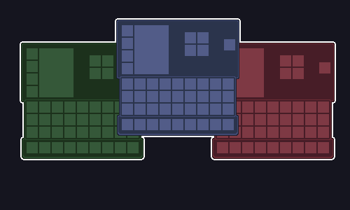

# SkyTones Hypixel Skyblock Resource Packs

SkyTones is a collection of recolor resource packs designed to enhance your Hypixel Skyblock experience with multiple beautiful palettes — including the classic FurfSky blue color.

---

## Supported Mods & Compatibility

Works great with popular mods and clients used in Hypixel Skyblock, such as:

-   Firmament
-   Skyblocker
-   Cookies Mod
-   REI (Roughly Enough Items)
-   And more mods to come!

---

## Installation

1. Download your favorite SkyTones palette pack [clicking on this link](https://github.com/ItzSylex/SkyTones/releases/tag/v0.7).
2. Download FurfSky 1.21.5 **Overlay**
3. Move the downloaded palette zip file into your Minecraft `resourcepacks` directory.
4. Open Minecraft and enable the resource pack from the Resource Packs menu.
5. Make sure FurfSky **Overlay** is **BELOW THIS PACK**

**Requirements:**

-   Minecraft 1.21.0+ (Fabric recommended for mod compatibility)

---

## Color Themes

| Theme           | Preview                                                  |
| --------------- | -------------------------------------------------------- |
| Arcane Plum     |          |
| Classic FurfSky |  |
| Crimson Blaze   |      |
| Verdant Ash     |          |
| Silver Shadow   |      |
| Violet Bloom    |        |
| Pale Coral      |            |
| Lilac Mist      |            |
| Icy Veil        |                |
| Coral Dust      |            |

## Credits

FurFsky for the iconic fan-favorite color theme.

## Disclaimer

I am not a designer nor artist. If you find any issues please let me know by opening an issue [on this link](https://github.com/ItzSylex/SkyTones/issues)

---

Enjoy a fresh new look in Hypixel Skyblock with **SkyTones**!
